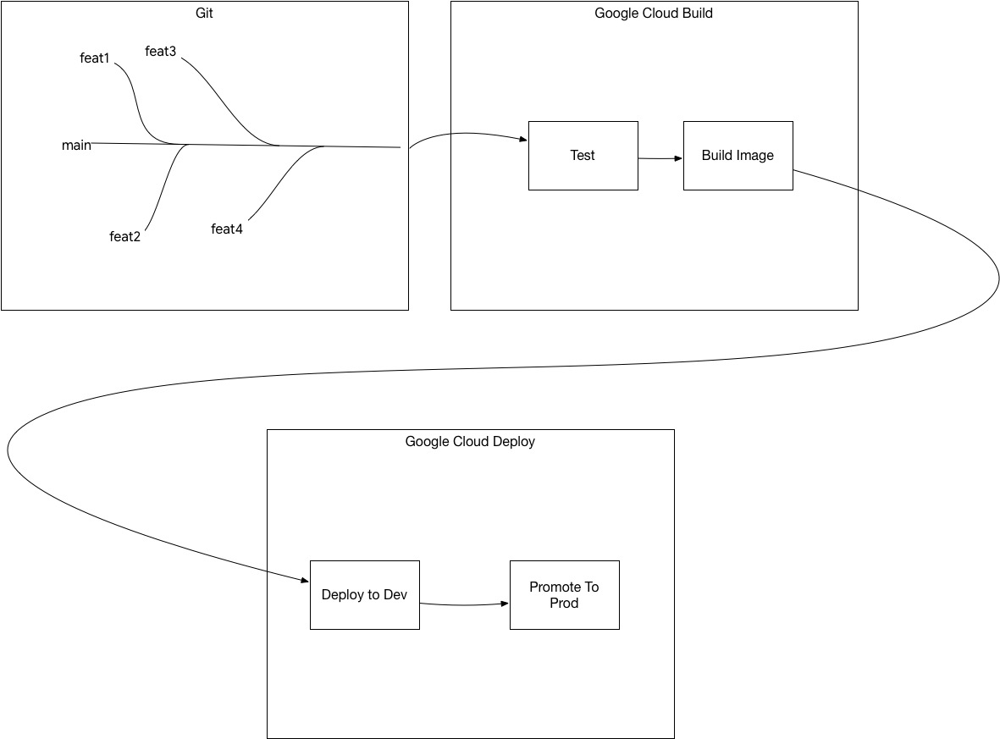

## Demonstrates using Google Cloud Deploy with a Java Project



This is a complete pipeline demonstrating:
1. Continuous integration process once a code is merged into the "main" branch of a project
2. Building an image once the tests are done
3. Deploying the image into a dev/test environment
4. Manual promotion of a deployment to prod environment

## Resources
- cloudbuild.yaml holds the CI pipeline steps
- clouddeploy.yaml holds the CD pipeline steps


## Deployment
- Create two clusters
  ```shell
  export PROJECT=$(gcloud config get-value project)
  export PROJECT_1=${PROJECT}
  export LOCATION_1=us-west1
  export CLUSTER_1=cluster1
  export CTX_1="gke_${PROJECT_1}_${LOCATION_1}_${CLUSTER_1}"
  
  export PROJECT_2=${PROJECT}
  export LOCATION_2=us-west1
  export CLUSTER_2=cluster2
  export CTX_2="gke_${PROJECT_2}_${LOCATION_2}_${CLUSTER_2}"
  
  gcloud container clusters create-auto ${CLUSTER_1} \
  --region ${LOCATION_1} \
  --release-channel "regular"
  
  gcloud container clusters create-auto ${CLUSTER_2} \
  --region ${LOCATION_2} \
  --release-channel "regular"
  ```
  
- Create a Cloud Build Trigger:
  - Using [Cloud Console](https://cloud.google.com/build/docs/automating-builds/create-manage-triggers)
  - OR using command line:
      ```shell
      gcloud beta builds triggers create github --repo-name hello-skaffold-gke --repo-owner bijukunjummen --branch-pattern '^main$' --name hello-skaffold-gke-exp --build-config cloudbuild.yaml
      ```
- Create a Deployment Pipeline -
    ```sh
    gcloud deploy apply --file=clouddeploy.yaml --region=us-west1
    ```
